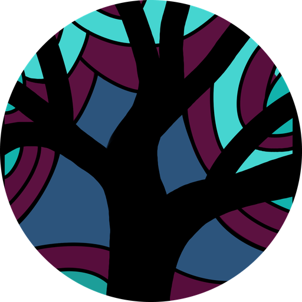

# Arynwood Cutroom

An AI-assisted video editor from [Arynwood Technology](https://arynwood.com), built on [Kdenlive](https://kdenlive.org).
Describe an edit in plain language and the **Cutroom Assistant**, a chat panel inside the editor, carries it out on your
timeline: with a model that runs on your own machine, and asking before it changes anything.

Arynwood Cutroom is a modified version of Kdenlive. It is not made or endorsed by the KDE project or the Kdenlive team.
It is built on the [D-Ogi/kdenlive](https://github.com/D-Ogi/kdenlive) fork, whose D-Bus scripting API everything below
depends on.

> **Status: working alpha, Linux only, build from source.** There are no published binaries yet. The assistant works end
> to end in testing, but small local models are unreliable at multi-step edits (see [Limits](#limits-read-this-first)).
> Nothing here is a stable release.

## What Cutroom adds to Kdenlive

- **The Cutroom Assistant**: a dock panel in the editor window, opened from the **Launch Assistant** button (the Arynwood
  tree, top right of the menu bar). Details [below](#the-cutroom-assistant).
- **A D-Bus scripting API** (from D-Ogi's fork): around 190 `Q_SCRIPTABLE` methods on `org.kde.kdenlive.MainWindow` for
  driving the editor from Python, the command line or any D-Bus client. See [below](#d-bus-scripting-api).
- **An MCP tool server, `mcp-kdenlive`**: 183 tools that an AI agent can call to operate the editor (import, cut,
  arrange, transitions, effects, keyframes, render). The assistant uses it, and so can Claude Code, Claude Desktop or your
  own scripts.
- **More Creative Commons media sources**: Jamendo (music) and Openverse, on top of Kdenlive's own providers.
- **A JavaScript expression engine** for keyframes and two **libplacebo** GPU effects (from D-Ogi's fork).
- **Its own identity**: name, About box, splash, the Arynwood tree, and a purple default colour scheme. Kdenlive is
  credited as what it is built on.

## The Cutroom Assistant

Click **Launch Assistant** (or **View → Cutroom Assistant**). The panel opens as a tab beside the Clip Monitor. Type what
you want ("show me a summary of the timeline", "add cross-dissolves between all the clips on the first video track") and the
assistant calls the editor's tools to do it.

- **Your model, your machine.** By default it talks to [Ollama](https://ollama.com) on `127.0.0.1`; nothing leaves the
  computer. It can also use any OpenAI-compatible endpoint. With a remote endpoint the conversation, including clip and
  file names in tool results, is sent to that service; the panel shows a warning and a one-time notice. It never uploads
  the media files themselves.
- **It asks before it changes your project.** By default every tool that changes the project waits for **Allow** or
  **Deny**. Reading, moving the playhead and making previews never ask. You can relax this in the panel's settings.
  Whatever the setting, it makes at most 12 tool calls per reply and 40 per request, and refuses to repeat an identical
  change after two runs.
- **It only sends the model the tools that look relevant** to the request (the full list is about 20,000 tokens, more
  than a small local model can use), plus a `search_tools` function for the rest.
- **It does not promise undo.** Many timeline edits can be undone, but not every scripted operation can, so save a copy of
  anything important first.

**What you need running:** the editor, Ollama (or another endpoint) with a model that supports tool calling, and the
`mcp-kdenlive` tool server on `127.0.0.1:8420`. The tool server is a separate process and is **not** bundled into the
flatpak yet. Step-by-step setup is in [SETUP.md](SETUP.md); the panel's design is in [src/aichat/README.md](src/aichat/README.md).

## Limits: read this first

- **Reliability is the model's, and small models are not reliable.** On "add all the photos in the bin to the timeline"
  (three runs each, against a dry-run proxy so nothing changed), `qwen2.5-coder:14b` got the exact call right once,
  `hermes3:8b` and `mistral:latest` never did, and `gpt-oss:20b` did not answer in four minutes on a 12 GB graphics card.
  That is a small sample, but it is why the panel asks before every change. A larger local model or a hosted one will do
  better.
- **Only Ollama and the OpenAI chat-completions dialect** are supported by the panel. Anthropic's own API is not (Claude
  Code and Claude Desktop still work through MCP from outside the editor).
- **Not yet done:** F1 opens Kdenlive's handbook, and there are no Windows or macOS builds. The Linux flatpak has its
  own application ID (`com.arynwood.Cutroom`) and can be installed beside Kdenlive; a build that is not a flatpak would
  still share its settings folder with a real Kdenlive.
- **Narrow windows:** below about 1250 px wide, the last menus fold into the `»` menu to make room for the launch button.
- **Linux only** so far; the flatpak build is the tested route.

## D-Bus scripting API

Exposed through D-Bus (`org.kde.kdenlive.MainWindow`); this is the layer the MCP tools and the assistant sit on.

| Category | Examples |
|----------|---------|
| **Project** | Open, save, new, properties, fps, resolution |
| **Media pool** | Import, folders, clip properties, delete, relink |
| **Timeline** | Insert, move, resize, cut, slip, delete clips; track management |
| **Effects** | Add/remove effects, get/set/update keyframes |
| **Compositions** | Add, move, resize, delete, list cross-track compositions |
| **Audio** | Volume get/set, audio fades, audio level analysis |
| **Subtitles** | Add, edit, delete, export; subtitle styles |
| **Markers/guides** | Add, list, delete by frame or category (timeline and clip markers) |
| **Groups** | Group/ungroup clips, query group membership |
| **Selection** | Get/set selection, select all, select by track |
| **Sequences** | List sequences, get/set active sequence |
| **Zones** | Get/set zone in/out points, extract zone |
| **Titles** | Create/read/update title clips (kdenlivetitle XML) |
| **Proxy** | Set, rebuild, delete, query clip proxy status |
| **Playback** | Seek, play, pause, get position |
| **Rendering** | Render timeline/bin frames as thumbnails, scene detection |
| **Undo** | Undo, redo, query undo stack status |

### JavaScript expression engine

An embedded QuickJS-based expression engine that allows keyframe parameters to be driven by JavaScript expressions (e.g.
`sin(time * 2)`, audio-reactive effects). Includes:

- Expression editor dialog with syntax highlighting
- Built-in function library (math, time, audio, easing)
- Expression template system with a repository of presets
- Expression cache for performance

### libplacebo effects

Two GPU-accelerated effects via libplacebo: shader and render.

## Python API and MCP server

The Python wrapper is [kdenlive-api](https://github.com/D-Ogi/kdenlive-api), a DaVinci Resolve-style client, and the MCP
server built on it is [mcp-kdenlive](https://github.com/D-Ogi/mcp-kdenlive). Arynwood's versions of both (MIT licensed,
183 tools) are kept separately from this repository and are not published yet; until they are, those are the public
originals.

```python
from kdenlive_api import Resolve

resolve = Resolve()
project = resolve.GetProjectManager().GetCurrentProject()
timeline = project.GetCurrentTimeline()
```

## Building

Setting this up on a new machine (flatpak build, D-Bus check, tool server, the assistant)? See [SETUP.md](SETUP.md).
How a release candidate is tested is in [dev-docs/release-testing.md](dev-docs/release-testing.md).

Otherwise follow the standard Kdenlive [build instructions](dev-docs/build.md). This fork tracks upstream `master`.
Additional build requirements:

- **D-Bus**: `-DUSE_DBUS=ON` (enabled by default on Linux, must be explicit on Windows via Craft)
- **QuickJS**: Bundled in `src/expressions/quickjs/` (no external dependency)

## Reporting problems, and funding

- **Problems with Cutroom** go to Arynwood, not to KDE: [arynwood.com](https://arynwood.com/#contact). There is no public
  issue tracker yet. Help → Report Bug… opens the same page.
- **Funding:** Cutroom has no donation route of its own yet. Until there is a stable release, if you want to support the
  work, support the project it is built on: [Kdenlive](https://kdenlive.org/fund).

## Licence and credits

- Cutroom's changes to Kdenlive, including the assistant panel, are **GPL-3.0-only**, like Kdenlive (see `LICENSES/`).
- `mcp-kdenlive` and `kdenlive-api` are separate packages under the MIT licence.
- The **Arynwood tree logo and splash image** (`data/pics/arynwood-logo.png`, `data/pics/arynwood-splash.png`) are
  artwork by Lorelei Noble, **all rights reserved**, and are *not* under the GPL; see
  `LICENSES/LicenseRef-Arynwood-Logo.txt`.
- The D-Bus scripting API, expression engine and libplacebo effects come from [D-Ogi's fork](https://github.com/D-Ogi/kdenlive).
- Kdenlive is developed by the [Kdenlive team](https://kdenlive.org) and KDE contributors; their credits are kept in the
  About box.

## Upstream

For general Kdenlive information, features, and downloads visit [kdenlive.org](https://kdenlive.org).
Upstream source: [KDE Invent](https://invent.kde.org/multimedia/kdenlive) / [GitHub mirror](https://github.com/KDE/kdenlive).
